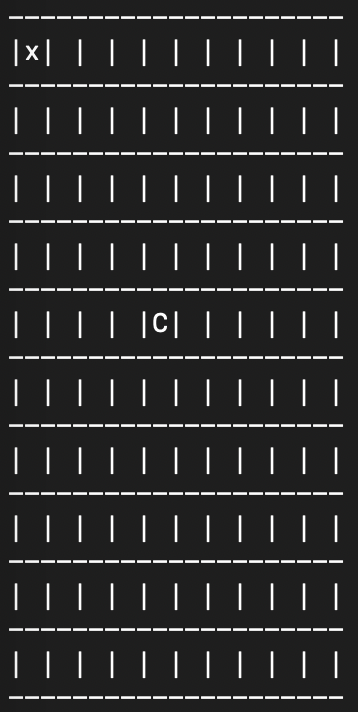

Automatic Robot - Elma
===

Project Goal :
---
Build a security gard robot running in a 2D array map automatically. Implement Elma as the event control manager in robot. Elma will control the robot core system syncing the latest map and battery status from map and battery event. User can set the map size, charging station location, running time and battery consuming ratio through a json file. Moreover, user will interact with the robot by sending intruder location through http protocal.

Milestones:
---

1. Implementing a robot which can automatically wandering on a 2D array map and also caculate the battery consuming and charging logic into robot's core system.

2. Adding a few featurers to robot which makes some actions after randomly dropped intruder in map. 

3. Completing the API documentation.

3. (TBD) Adding a function letting user can set all the robot logic in a json file and get the latest status through http protacal "GET".

4. (TBD) Add a function letting user interact with robot through http protocal "POST".

5. (TBD) Transform the robot in 2D map into graphic user interface.