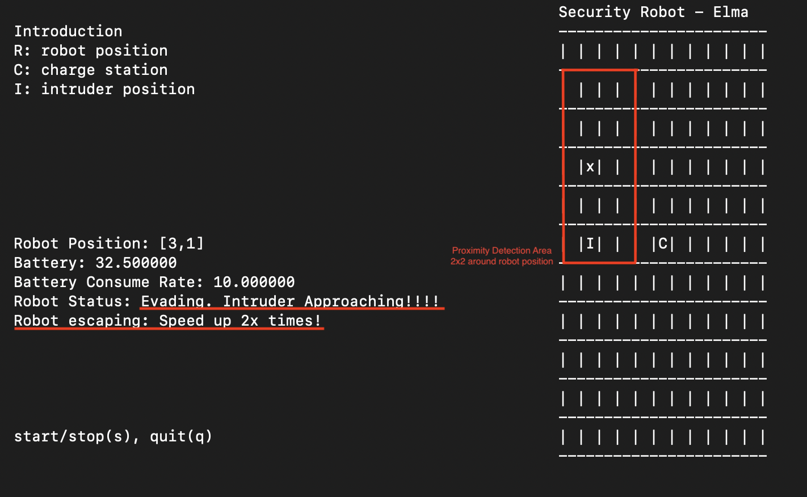

Lifetime Security Guard Robot - Elma 
===

Project Goal :
---
A lifetime security guard robot wandering around on a 2D array map and helping you detect the intruder until you shut it down. User can start orstop the robot by using keyboard 's'. Also, user can adjust most of the robot setting in [jason file](robot_setting.json).

There might have an intruder showing on the map in random location(default setting is changing location for every 5 seconds). Besides that, the robot will stop and make noise after it found an intruder in its detecting area. If the intruder is too close to the robot, the robot will use 2x speed escaping on the map.

The robot will continue wandering around, detecting intruder and recharging itself and it won't be shut down before you press 'q' to quit.

Installation
---
	
~~~~
git clone https://github.com/earnie08/Security-Robot.git
cd security-robot
docker run -v $PWD:/source -it klavins/elma:latest bash
make
~~~~

Execution
---
To run the default obot, type
~~~
bin/robot
~~~
The robot is controlled via the keyboard, via these keys:

+ s: Start or Stop
+ q: Quit

Can switch to customize robot setting. To paste the test case called "SettingFromJson" from unit_test.cc to main.cc and "make" again.

Testing
---
To run tests, do
~~~
bin/test
~~~

There are three parts of test case:

1. Default Robot Setting: use default setting to run the robot
2. Json file testing: test json file information
3. Customize Robot Setting: use customize setting to run the robot

Architecture
---
- [Map Information](#mpinfo) ([MapInfo.h](mapInfo.h))
- [Battery Information](#battery) ([Battery.h](battery.h))
- [Intruder](#intruder) ([Intruder.h](intruder.h))
- [Robot](#robot) ([Robot.h](robot.h))
- [Robot Interface](#ui) ([Robot_Interface.h](robot_interface.h))
- [Customize Setting](#setting) ([Setting.h](setting.h))
    - - -
    ### __Map Information__
    Create and set all the position on the 2D array map including robot position 'x', charge station 'C' and intruder position 'I'.
    
    Default map setting:
    > map size : __11*11__
    
    > initial robot location : __[0,0]__
    
    > charge station location : __[5,5]__

    Symbol on the map:
    > Robot : __x__

    > Charge Station : __C__

    > Intruder : __I__

    The map size, initial robot position and charge station position can be set in the customize json file.
    
    ### __Battery__
    Set the battery capacity and set the battery consuming rate. Battery charging speed is depends on the default consuming rate.
    
    Default Battery setting:
    > Capacity : __100__

    > Consume Rate : __5__

    The capacity, consume rate can be set in the customize json file.

    ### __Intruder__
    Intruder class is inherited to elma's process class. The intruder will update it's location every 5 seconds(update time can be changed in main.cc) and stop when user press stop button('s'). The location is randomly.

    ### __Robot__
    Robot class is inherited to elma's state machine class. In the robot state machine, there are serveral states and functions.
    
    States:
    
    
    
    - Off ([off.h](off.h)): Press 's' to start the robot.
    - Wander ([wander.cc](wander.cc)):
        1. Detect intruder's position. If intruder is in the detction area, set the battery consume rate to the half of default rate.
        2. Detect the battery status.
        3. robot will move 1 step each time, the direction is up, left, right and down.
    - Noise ([noise.cc](noise.cc)):
        1. Detect intruder's position. If intruder is out of the detection area, reset the consume rate, trun of the noise and back to wander state.
        2. Detect whether the intruder is in the proximity area. If true, sett the battery consume rate to 2 times of default rate.
        3. Detect the battery status. 
        4. Robot stop wandering.
        5. Making noise. 
    - Evade ([evade.cc](evade.cc)):
        1. Detect intruder's position. If intruder is out of the proximity area, reset the consume rate and back to noise state.
        2. Detect the battery status.
        3. robot will move 2 steps each time to escape. The direction is ramdomly.
    - Finding ([finding.cc](finding.cc)):
        1. Detect robot is in charge station or not. If it's in the charge station, start charging.
        2. Plan the path to charge station. The route logic is that robot will go x-axis first until it has the same x value as charge station. If the intruder showed up on the route and it's in front of the robot, robot will detour or try to go y-axis first.
         Examples:
        
            | __General__ | __Detour__ | __Y-asix First__ |
            |:-----------:|:----------:|:----------------:|
            | |  |  |

    - Charging ([charging.cc](charging.cc)):
        1. Charging rate is 2 times of the default consume rate.
        2. If the battery is full, set the robot position at the last location.

    Functions:
    - __batteryDetection__ : Detect whether battery can support robot go back to charge station. Reserved 2 steps for robot to avoid it needs to detour.

    - __intruderDetection__ : Detect whether intruder's loaction is in the detection area, default is 4x4 area from robot's loaction on map.

    - __proximityDetection__ : Detect whether intruder's loaction is too close to robot, default is detecting 2x2 area arond robot's loaction on map.

    ### __Robot Interface__
    To show the robot introduction, robot status, battery status and map information on terminal.
    User can start and stop the robot by using 's' button and press 'q' for quit.
    Stop button can only be detected when robot is wandering.
    Quit button can be pressed in anytime.
    
    __Default Interface:__
     

    __Customize Robot Interface:__
     

    ### __Customize Setting__
    Customize setting for the robot.
    
    There are some restriction for customize setting:
    - Robot Name: should be __string__ type.
    - Map Size: should be in range __5__ to __20__. (for the best visualization)
    - Battery Size: should __greater than consume rate__ and __0__
    - Battery Consume Rate: should __greater than 0__. 
    - Charge Station: x and y shold __smaller than map size__ and __greater or equal to 0__.
    - Robot Position: x and y shold __smaller than map size__ and __greater or equal to 0__.
    - Robot Detection Area: should be __smaller or equal to map size__.
    - Robot Detection Area: should be __smaller or equal to map size__.

    **Battery size divided to two times consume rate should be smaller than the steps that robot needs to go back to charge station.

    Example:
    ~~~
    {
        "Robot Name": "Security Robot",
        "Map Size": 20,
        "Battery Size": 100,
        "Battery Consume Rate": 2,
        "Charge Station": [19,19],
        "Robot Position": [0,0],
        "Robot Detection Area": 20,
        "Robot Proximity Area": 20
    }
    ~~~

Results
---
__Making Noise:__

 

__Evading:__

 

__Battery Low:__

 

__Charging:__

 

Milestones & Progess:
---

1. To implement an automatically wandering robot on a 2D array map and also caculate the battery consuming and charging logic into robot's state machine system. __(2/28-3/7)__

2. Adding a few featurers to robot which makes some actions after randomly dropped intruder in map. __(2/28-3/7)__

3. Add customize setting feature. __(3/8-3/13)__

4. Modify functions to adjust customize setting from Json file. __(3/8-3/13)__

5. Transform the robot on terminal 2D map into terminal graphic user interface. __(3/14-3/21)__

6. Completing the API documentation. __(3/14-3/21)__

References
---
+ elma : https://github.com/klavinslab/elma_project
+ robot state machine: https://github.com/klavins/ECEP520/blob/master/week_7/images/robot.png